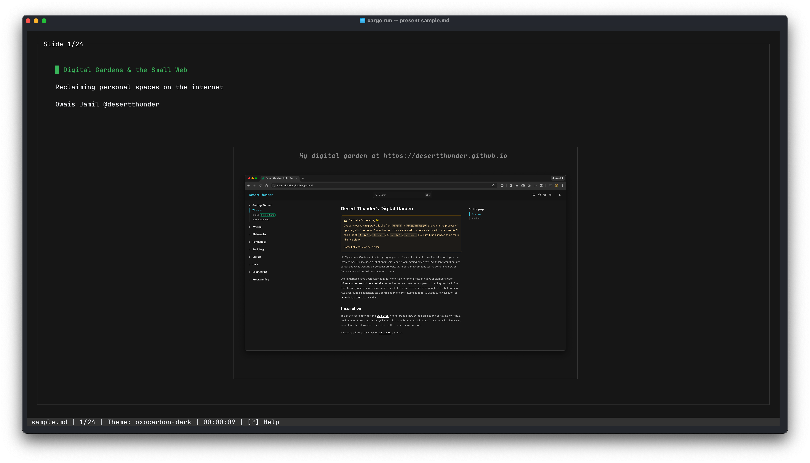
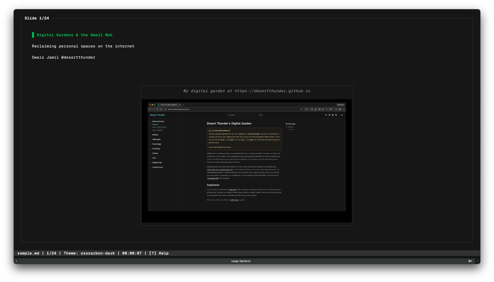

# lantern

A modern, fast terminal presentation tool built with Rust.

<details>
<summary>
Now with image support (if your terminal supports it!)
</summary>





</details>

## Quickstart

### Installation

From a local clone:

```bash
cargo install --path .
```

From GitHub:

```bash
cargo install --git https://github.com/stormlightlabs/lantern.git lantern-cli
```

From Tangled:

```bash
cargo install --git https://tangled.sh/desertthunder.dev/lantern lantern-cli
```

### Create Your First Deck

Create a markdown file `presentation.md`:

````markdown
---
theme: nord
---

# Welcome to lantern

A terminal presentation tool built with Rust

---

## Features

- Base16 theming system
- Syntax highlighting
- Tables, images, and admonitions
- Speaker notes with `::: notes`
- Print to stdout

::: notes
These notes stay out of the main slide and appear in the presenter notes panel.
Press Shift+N while presenting to toggle the panel.
:::

---

## Code Example

```rust
fn main() {
    println!("Hello, lantern!");
}
```

---

## That's it

Press `q` to quit, `←/→` to navigate
````

### Present

```bash
# Interactive TUI mode
lantern present presentation.md

# Print to stdout
lantern print presentation.md

# With a built-in theme
lantern present presentation.md --theme catppuccin-mocha
```

### Navigation

| Key                    | Action             |
| ---------------------- | ------------------ |
| `→`, `j`, `Space`, `n` | Next slide         |
| `←`, `k`, `p`          | Previous slide     |
| `Shift+N`              | Toggle notes panel |
| `?`                    | Toggle help line   |
| `q`, `Ctrl+C`, `Esc`   | Quit               |

## Design Principles

**Color as Data:**
All color use flows through typed wrappers using `owo-colors`. No ad-hoc ANSI escapes.

**Themeable:**
Built on the [Base16](https://github.com/chriskempson/base16) theming system with 10 prebuilt themes
(Catppuccin, Nord, Gruvbox Material, Solarized, Oxocarbon).

Each theme defines 16 semantic colors mapped to content and UI elements.

Themes can be selected via frontmatter, CLI flags, `--theme-file`, config-directory theme files, or
environment variables.

**Reproducible:**
Everything is reproducible in plain text — decks can render without TUI (using `lantern print`).

**Composable:**
Parser → Model → Renderer are independent modules with tests and traits.

**Portable:**
Runs on any terminal supporting UTF-8; dependencies limited to core crates.

## Testing

This project uses `cargo-llvm-cov` for coverage

Installation:

```sh
# MacOS
brew install cargo-llvm-cov

# Linux
cargo +stable install cargo-llvm-cov --locked
```

Run tests:

```sh
cargo llvm-cov

# Open the browser
cargo llvm-cov --open
```

## Inspiration

- [`maaslalani/slides`](https://github.com/maaslalani/slides)
- [`d0c-s4vage/lookatme`](https://github.com/d0c-s4vage/lookatme)

## License

[MIT](./LICENSE)
